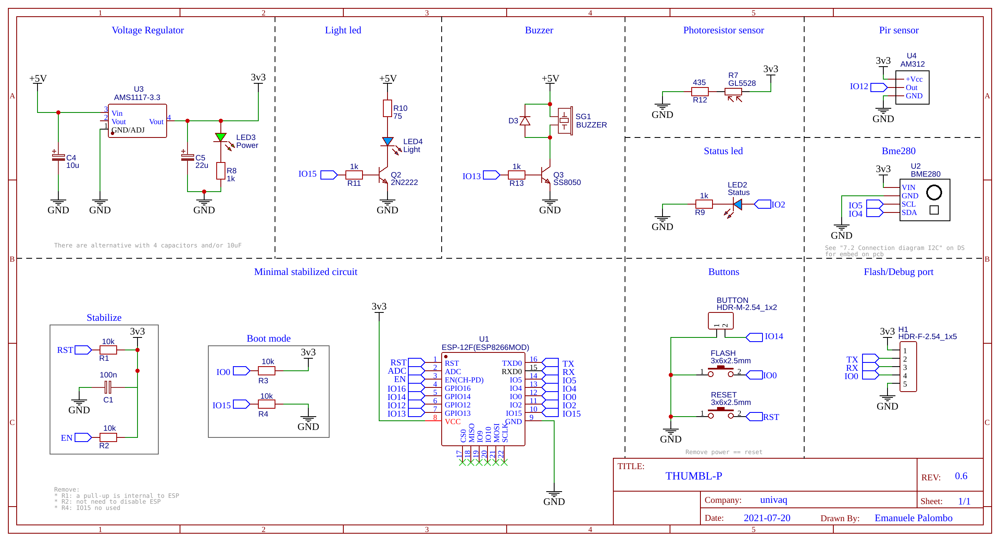

**This device is intended as an implementation example of [YAHNC](https://github.com/elbowz/yahnc) lib**

## THUMBL-P 

###### Temperature HUmidity Motion Buzzer Light - Pressure

THUMBL-P is a device with the following sensors and actuators:
* `SwitchNode` aka *Led*
* `BME280Node` aka *Temperature*, *Humidity* and *Pressure*
* `BinarySensorNode` aka *Motion* or *Pir*
* `ButtonNode` aka *Button* for user input
* `GL5528Node` extend `AdcNode` aka *photoresistor* for luminosity
* Buzzer, implemented in the Homie "classic way" `HomieNode`

All the sensor are published on MQTT topic and will be updated following the given `RetentionVar` policies (eg. 0.8 lux absolute variation).
Buzzer can playback rtttl format melodies. These can be preset or sent in a json payload through `/play` topic, eg:

Raw text for preset melodies  
`
tetris
`

Json for preset or custom melodies, enriched with number of repetition and ms gap:
```json
{
  "preset": "siren",
  "loop-count": 3,
  "loop-gap": 1000
}
```
```json
{
  "rtttl": "The Simpsons:d=4,o=5,b=160:c.6,e6,f#6,8a6,g.6,e6,c6,8a,8f#,8f#,8f#,2g,8p,8p,8f#,8f#,8f#,8g,a#.,8c6,8c6,8c6,c6",
  "loop-count": 2,
  "loop-gap": 2000
}
```

It can work also without a connection: switch on led on motion detected (*pir*) during night (*photoresistor*). 

The led light timeout and lux treshold can be set by `HomieSetting`: *lightOnMotionTimeout, lightOnMotionMaxLux*  

### Notes

It should be taken as example to explain the [YAHNC](https://github.com/elbowz/yahnc)  (Yet Another Homie Node Collection) libs. So mainly to compare a classic HomieNode implementation (eg Buzzer) with the other Nodes (eg `BME280Node`)

### Circuit 



You can acces and modify full the [open source schematic](https://oshwlab.com/muttley/thumbl-p) with [easyeda.com](https://easyeda.com/).

